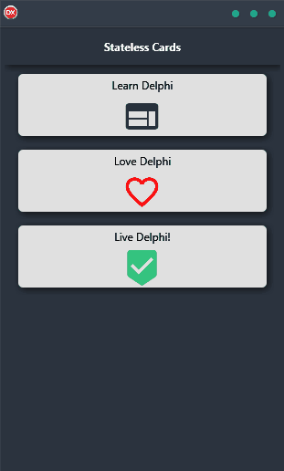

If you're looking for a way to build interface elements that don't keep track of previous interactions, Stateless Cards Demo is the perfect solution. With this cross-platform application, you can create beautiful cards that align vertically and feature other interface elements like buttons and input fields. Best of all, it's built using a single code base and single UI, so you can use it on any platform, including Android, iOS, macOS, Windows, and Linux. Give Stateless Cards Demo a try today and see how easy and fun it is to create stunning interface elements that work perfectly on any device.

