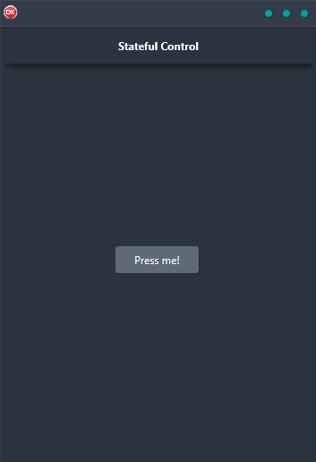

The Stateful Control Demo is a cross-platform application that allows you to change the state of interaction through the text displayed on a button. Each time the button is clicked, the text of the button changes. The text of a button is stored in an in-memory table, and the selected record changes. This demo is built in Delphi using a single code base and single UI for Android, iOS, macOS, Windows, and Linux.

