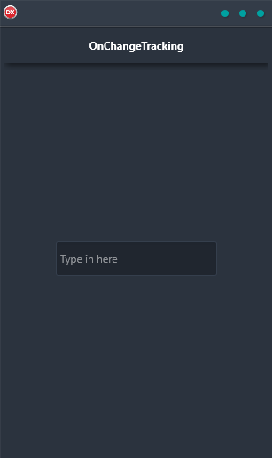

OnChange Tracking Demo is the perfect way to learn how to build a demo that handles an OnChange event. This cross-platform application is built in Delphi using a single code base and single UI for Android, iOS, macOS, Windows, and Linux. With OnChange Tracking Demo, you'll be able to quickly and easily create a demo that tracks changes in data. This is an essential tool for anyone who wants to learn how to build demos or for developers who need to track changes in their data. OnChange Tracking Demo is the perfect solution for tracking changes in data on any platform.

