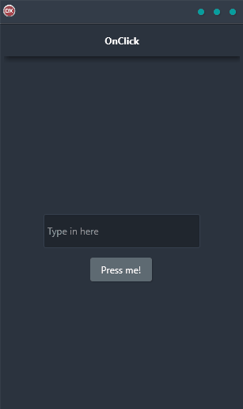

OnClick Demo is the perfect tool for anyone looking to build a demo that handles an OnClick event. It is a cross-platform application built in Delphi using a single code base and single UI for Android, iOS, macOS, Windows, and Linux. OnClick Demo makes it easy to create a demo that is both professional and engaging. It also allows you to customize your demo to fit your specific needs.

