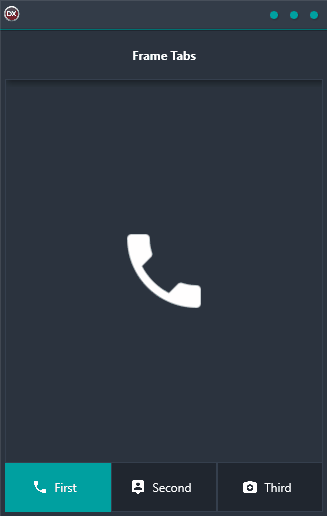

Frame Tabs Demo lets you easily build a set of tabbed navigation pages for your Android, iOS, macOS, Windows, or Linux app. Using the Frames feature in Delphi, you can isolate and re-use code and UI elements in multiple places. This makes it easy to create a consistent look and feel across your app. Frame Tabs Demo is a cross-platform application built using a single code base. This makes it easy to maintain and update your app.

