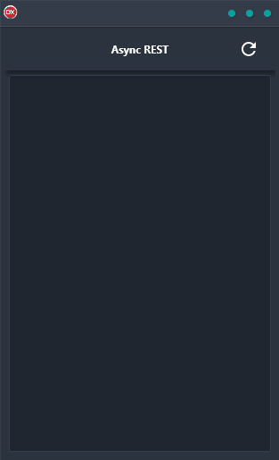

If you're looking for a cross-platform application that demonstrates how to do an asynchronous REST API call, look no further than the Async REST Demo. This powerful little app is built in Delphi using a single code base and single UI, making it truly cross-platform. And because it's asynchronous, you can be sure that your results are always up-to-date.

