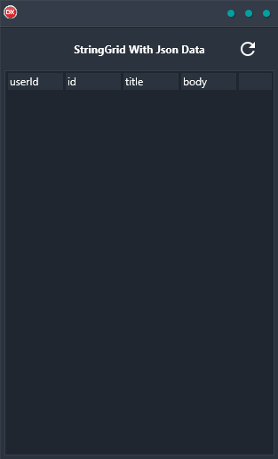

The StringGrid With JSON Data Demo is a powerful and easy-to-use tool for building dynamic and interactive applications. The demo shows how to populate a stringgrid using JSON data, and is a cross-platform application that can be used on Android, iOS, macOS, Windows, and Linux. The demo is built in Delphi using a single code base and single UI, making it easy to create beautiful and robust applications. With the StringGrid With JSON Data Demo, you can quickly create sophisticated and user-friendly applications that are sure to impress your users.

