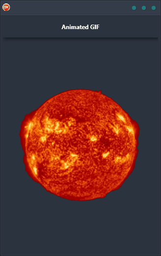

Animated GIF Demo is the perfect way to show off your application's animation capabilities. With this cross-platform app, you can easily load and play an animated GIF from within your app. Built in Delphi, Animated GIF Demo uses a single code base and single UI for Android, iOS, macOS, Windows, and Linux. This makes it easy to create a consistent look and feel across all platforms.

