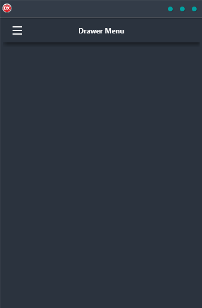

If you're looking for a way to add a hamburger menu to your cross-platform application, look no further than the Drawer Menu Demo. This demo shows you how to build an app with a drawer menu that slides out from the left side of the screen, making it easy and intuitive to navigate your way around. Plus, it's built in Delphi using a single code base and single UI, so you can be sure it will work seamlessly on Android, iOS, macOS, Windows, and Linux. So why wait? Give the Drawer Menu Demo a try today and see how it can take your app to the next level!

