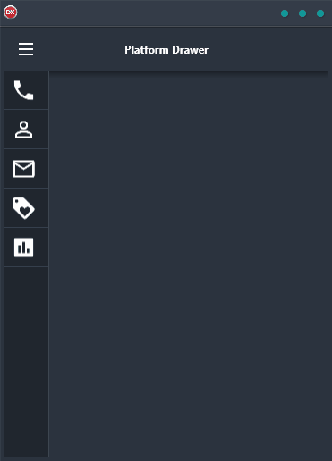

If you're looking for a cross-platform application that is built in Delphi and uses a single code base, then the Platform Menu Demo is perfect for you. This helpful demo application shows you how to build an app with a hamburger menu that contains a drawer. The drawer is a Platform canvas which helps solve Z-Order issues. Plus, the menu slides out from the left side of the screen for easy accessibility. With this demo app, you'll be able to create a great looking and functioning application for Android, iOS, macOS, Windows, and Linux. So don't wait any longer, check out the Platform Menu Demo today!

