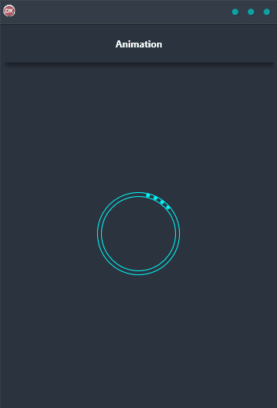

Animation is a critical part of modern user interface design. It can add polish and sophistication to your app, and make the user experience more enjoyable. The Animation Demo shows you how to use FireMonkey to create an animated progress spinner. This cross-platform application was built in Delphi using a single code base and single UI for Android, iOS, macOS, Windows, and Linux. With just a few lines of code, you can add this impressive animation to your own apps. Try it out today and see the difference that animations can make!

