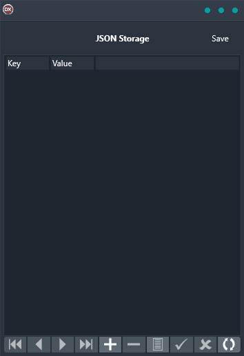

The JSON Storage Demo is a powerful and cross-platform application that allows you to save your in-memory Delphi dataset as a JSON formatted file. With this demo, you can quickly and easily learn how to store your data in the most popular format for web and mobile applications. The demo is built using a single codebase and single UI for Android, iOS, macOS, Windows, and Linux platforms, making it easy to use and portable. Additionally, the demo is professional and easy to follow, providing clear instructions on how to correctly store your data in JSON format.

