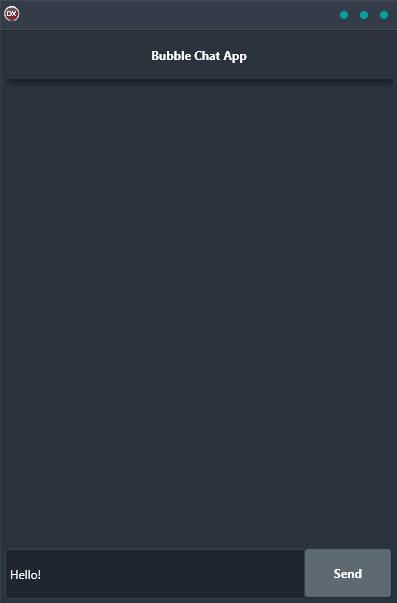

If you're looking for a way to build a chat interface that's both user-friendly and visually appealing, the Bubble Chat App Demo is just what you need. This cross-platform application, built using Delphi, offers a single code base and UI that can be used on Android, iOS, macOS, Windows, and Linux. And because it uses a bubble chat interface like that found in popular apps like WhatsApp, Facebook, Instagram, and others, your users will feel right at home. So why wait? Get started today and see just how easy and fun it is to build a Bubble Chat App!

