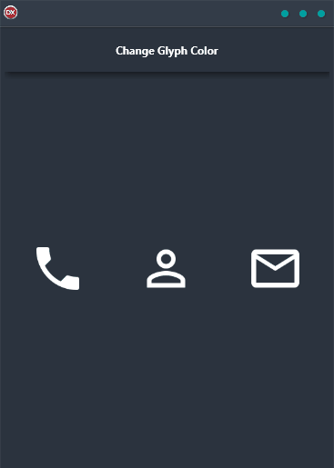

Are you looking for an easy way to change the color of a glyph in your FireMonkey application? Look no further than the Change Glyph Color Demo! This demo shows you how to use a FireMonkey TEffect to quickly and easily change the RGB color of a TGlyph with just one line of code.

This demo is perfect for Android, iOS, macOS, Windows, and Linux developers who want to create cross-platform applications with a single code base and single UI. So whether you're targeting mobile devices or desktop computers, the Change Glyph Color Demo has you covered. Give it a try today and see how easy it is to add some flair to your FireMonkey applications!

