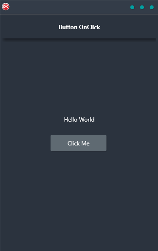

If you're looking for a way to add some interactivity to your mobile applications, the Button OnClick through Actions demo is a great place to start. This cross-platform application shows you how to define an OnClick event on a button and have it change another interface element. Built in Delphi using a single code base and single UI, the Button OnClick demo is perfect for Android, iOS, macOS, Windows, and Linux. So why wait? Give it a try today and see how easy it is to add some excitement to your app development!

