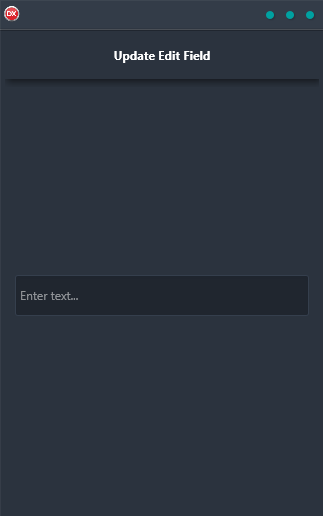

The Update Edit Field Demo is a great way to learn how to use data with Live Bindings. This cross-platform application makes it easy to bind the contents of an edit field with a label, using a single code base and single UI for Android, iOS, macOS, Windows, and Linux. With this demo, you'll be able to quickly and easily update your labels with new data, keeping your user interface consistent across all platforms.

