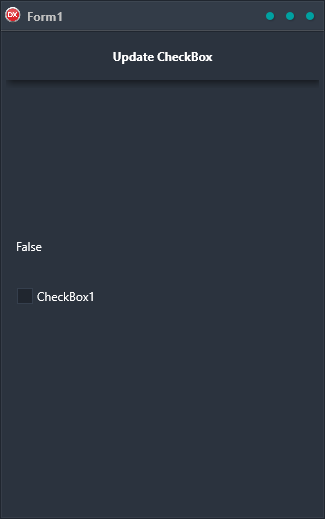

The Update Checkbox Demo is the perfect way to show how Live Bindings can be used to update a label when a checkbox changes. It is a cross-platform application that has been built in Delphi using a single code base and single UI for Android, iOS, macOS, Windows, and Linux. This makes it the perfect tool for anyone who wants to learn how to build cross-platform applications using Live Bindings.

