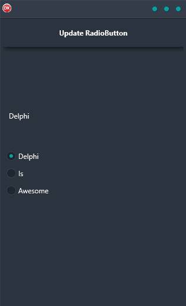

The Update Radio Button Demo is the perfect way to keep your data table up-to-date. Using Live Bindings, this demo cross-platform application automatically updates your in-memory data table whenever a radio button changes. With support for Android, iOS, macOS, Windows, and Linux, you can build a single code base that looks and feels great on any platform.

