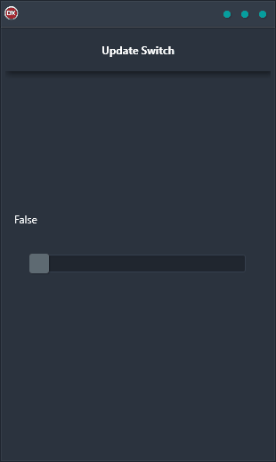

If you're looking for a quick and easy way to update an in-memory data table, the Update Switch Demo is the perfect solution. Built in Delphi, this cross-platform application is designed to work on Android, iOS, macOS, Windows, and Linux. With a single code base and single UI, it's easy to keep your data updated across all your devices. Plus, the Live Bindings feature makes it super simple to update your data when a switch control changes. So if you need a fast and reliable way to keep your data up-to-date, the Update Switch Demo is the perfect tool for the job.

