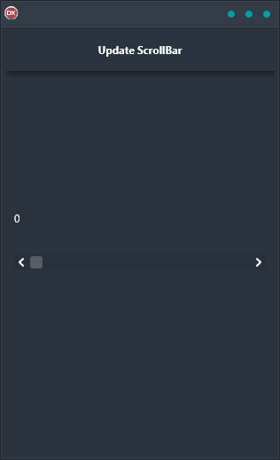

The Update ScrollBar Demo is the perfect way to see how Live Bindings can help keep your Edit control and Scrollbar control in sync. This cross-platform application has been built using a single codebase and UI, so it's easy to use no matter what your preferred operating system might be. The Delphi-based app is fully compatible with Android, iOS, macOS, Windows, and Linux, making it incredibly versatile. With this demo, you'll see how Live Bindings can make it easy to keep your information up-to-date and accurate - no matter where you are or what device you're using. Take a look!

