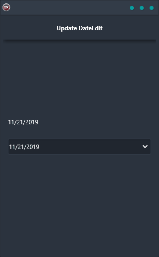

Do you need an easy way to keep your DateEdit control up-to-date? Then you need the Update DateEdit Demo! This cross-platform application makes it a breeze to update your DateEdit control through an in-memory data table, regardless of which operating system you're using. And because it's built in Delphi, you can be sure that the code is clean and reliable. So why wait? Get the Update DateEdit Demo today!

