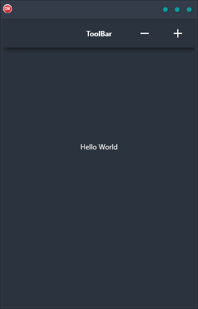

The ToolBar Demo is the perfect way to get started with building cross-platform applications with a single code base. This demo shows you how to set up buttons in a toolbar and design their OnClick events, making it easy to create a consistent look and feel across all your devices. With support for Android, iOS, macOS, Windows, and Linux, the ToolBar Demo is the perfect way to get started with building beautiful, responsive applications.

