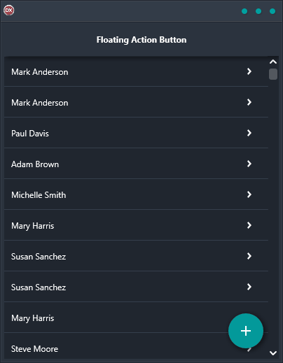

Looking for an easy and effective way to add records on Android, iOS, macOS, Windows, and Linux? Check out our Floating Action Button demo! With a button that floats over other controls as you scroll up and down, this is a popular interface mechanism that makes it easy and convenient to add new records. Plus, it's cross-platform and built in Delphi using a single code base and single UI, so you can be sure it will work seamlessly no matter what platform you're using. Take a look.

