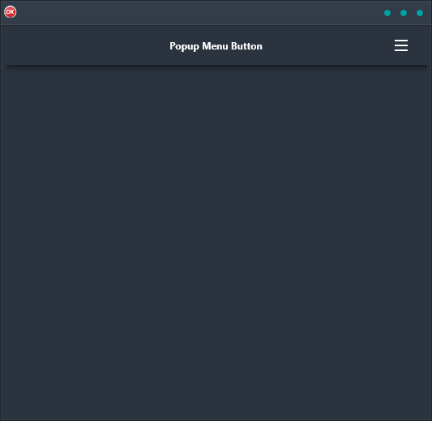

The Popup Menu Button is a cross-platform application that allows you to define a hamburger menu button in a toolbar and have a scrollable menu pop up over the rest of the app interface. This is a great way to keep your app organized and simplify navigation for your users. The Popup Menu Button is built in Delphi using a single code base and single UI, so it works seamlessly on Android, iOS, macOS, Windows, and Linux. With its easy-to-use interface and powerful features, the Popup Menu Button can be the perfect solution for your menu needs.

