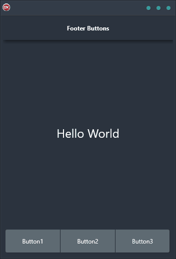

Do you want to add some pizzazz to your application? Check out our Footer Buttons Demo! This handy cross-platform tool can show you how to create 3 buttons that stick or float at the bottom of your app. No matter what operating system you're using – Android, iOS, macOS, Windows, or Linux – ourFooter Buttons Demo will work seamlessly. And because it's built in Delphi, you can be sure it's a high-quality product. So why not give it a try today and see how easy and fun it is to use our Footer Buttons Demo!

