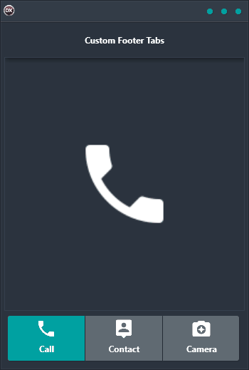

The Custom Footer Tabs Demo is the perfect way to add customization to your tab buttons. With this demo, you can add custom icons and change the current page of the TTabControl with ease. This cross-platform application is built using Delphi and provides a single code base and UI for Android, iOS, macOS, Windows, and Linux. Whether you're a seasoned developer or just getting started, the Custom Footer Tabs Demo is the perfect solution for your needs.

