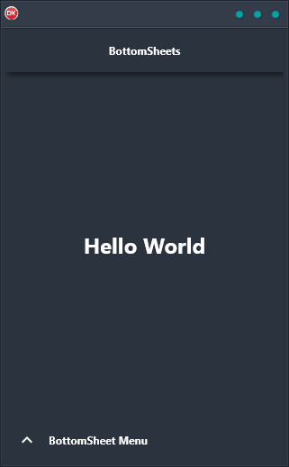

The Bottom Sheet Demo is a cross-platform application that features a floating menu at the bottom of the screen. This menu unfurls to reveal a menu above the rest of the app interface, making it easy and convenient for users to access the various features and options within the app. The Bottom Sheet Demo has been built using a single code base and single UI for Android, iOS, macOS, Windows, and Linux, making it compatible with a wide range of devices and operating systems. With its sleek and user-friendly design, the Bottom Sheet Demo is perfect for anyone who wants a simple and effective way to manage their apps.

