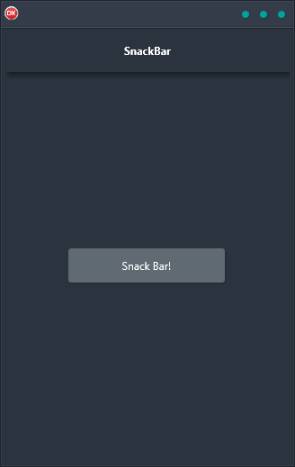

The SnackBar demo is a cross-platform application that features a button that fires a FloatAnimation for opening a message notification that scrolls in from the bottom of the screen. It is built in Delphi using a single code base and single UI for Android, iOS, macOS, Windows, and Linux.

With the SnackBar demo, you'll be able to quickly and easily create engaging, persuasive, and creative marketing materials that will grab attention and drive results. From simple one-off notifications to complex multi-step campaigns, SnackBar has you covered. And because it's built on the cross-platform Delphi framework, you can be sure that your campaigns will look great and work flawlessly on any device.

