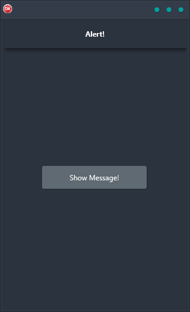

ShowMessage is the perfect solution for showing message dialog boxes on any platform. It is built using Delphi and thus offers a cross-platform solution that is reliable, efficient, and easy to use. The functionality ties into the native show message dialog of the current platform making it even more user-friendly. Whether you're building an app for Android, iOS, macOS, Windows, or Linux, ShowMessage has you covered. So why wait? Check out the ShowMessage Dialog Demo today!

