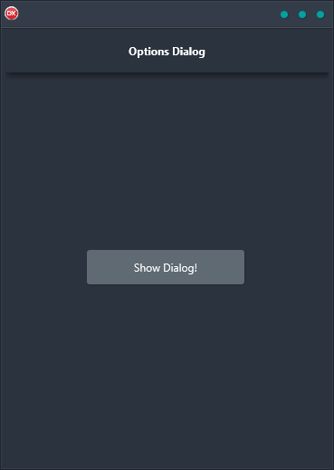

The Options Dialog Demo is a cross-platform application that features a native platform message dialog box and two buttons. The Yes and No buttons when selected pass the selection back to the code for processing. It is built in Delphi using a single code base and single UI for Android, iOS, macOS, Windows, and Linux.

