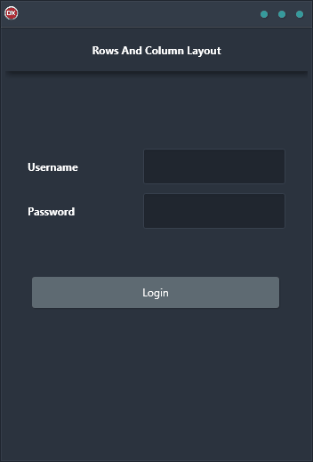

Are you looking for a way to build complex row and column layouts? If so, the Rows and Column Layout Demo is the perfect tool for you! This cross-platform application makes it easy to create stunning layouts for Android, iOS, macOS, Windows, and Linux. Built in Delphi, the Rows and Column Layout Demo uses a single code base and single UI, making it super easy to use. Plus, with its step-by-step instructions, you'll be able to create beautiful layouts in no time! So why wait? Get started today and see what the Rows and Column Layout Demo can do for you!

