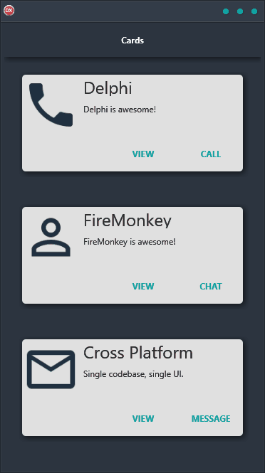

If you're looking for a creative and engaging way to demonstrate your product or service, the Cards Demo is perfect for you! This cross-platform application makes it easy to build a layout featuring a number of cards stacked vertically, each containing graphics and buttons. With a single code base and single UI for Android, iOS, macOS, Windows, and Linux, the Cards Demo is perfect for any business or individual looking to show off data in their app in a unique and persuasive way.

