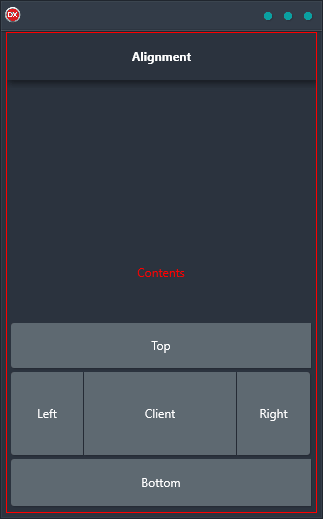

The Alignment demo is a great way to explore how you can use the Align property to build amazing layouts. With a number of buttons aligned to the top, left, right, and bottom of a layout, it's a cross-platform application that is perfect for anyone looking to improve their layout skills. Built in Delphi using a single code base and single UI for Android, iOS, macOS, Windows, and Linux, the Alignment demo is a must-have for anyone looking to take their layouts to the next level.

