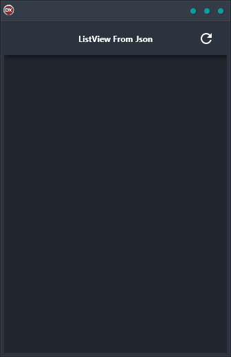

If you're looking for a quick and easy way to get started with cross-platform development, then you'll want to check out the ListView from JSON Demo. This handy little tool lets you download a list of countries in JSON format, and then parses the JSON and loads it into a ListView control. That means you can have a single code base and single UI for Android, iOS, macOS, Windows, and Linux. Plus, the demo comes with full source code so you can easily customize it to fit your needs. So why wait? Give the ListView from JSON Demo a try today!

