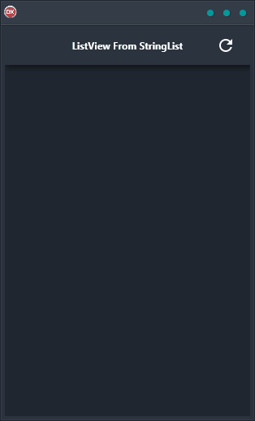

ListView from StringList Demo is a cross-platform application that creates a string list with line delimiters and then loads the list of strings into a ListView control. It is built in Delphi using a single code base and single UI for Android, iOS, macOS, Windows, and Linux. This makes it easy to develop and deploy your applications on multiple platforms. The ListView control is highly customizable and supports various features such as sorting, filtering, and grouping.

