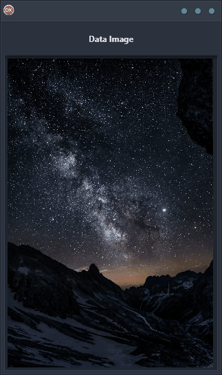

The Data Image Demo is the perfect way to learn how to load and store images in an in-memory data table. This cross-platform application is built using Delphi, making it easy to use on Android, iOS, macOS, Windows, and Linux. The Demo features an ImageControl that guides you through the steps needed to load an image from file and store it within an in-memory data table. With this information at your fingertips, you'll be able to use images more effectively within your applications. Get started today and see the benefits for yourself!

