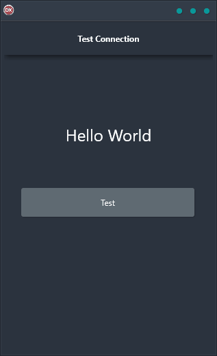

The Test Connection Demo is a powerful, cross-platform application that makes it easy to test your internet connection. With just a few clicks, you can quickly and easily determine whether or not you have an internet connection. Simply enter a web address and the Test Connection Demo will attempt to make a TCP socket connection on port 80. If it is able to connect, then there is an active internet connection. If there is an error or timeout, then no internet connection was detected. This simple yet powerful tool is essential for anyone who needs to quickly and easily test their internet connection.

