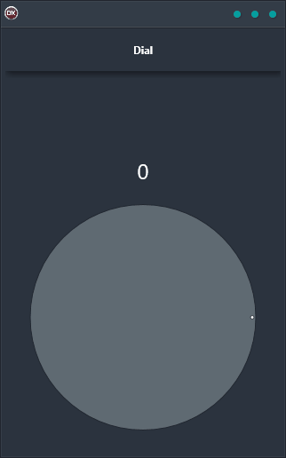

Do you want an interactive way to engage your customers? Then you need the Dial Demo! This innovative application features an ArcDial component or knob that can be rotated with a mouse cursor or touch screen. The value of the ArcDial is stored in an in-memory data table using LiveBindings, making it extremely user-friendly. Plus, it's cross-platform, so you can use it on Android, iOS, macOS, Windows, and Linux. With its single code base and single UI, the Dial Demo is ideal for any business. So give your customers the interactivity they crave with this cutting-edge application.

