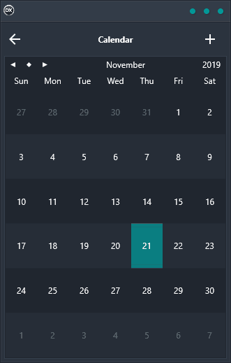

The Calendar Demo is the perfect way to keep track of important dates and events. With its easy-to-use interface and cross-platform compatibility, it's the perfect tool for busy professionals who need to stay on top of their schedules. The Calendar Demo features a calendar where specific dates can be added and displayed, and added dates are stored in an in-memory data table through data bindings. So whether you're planning your next big project or just keeping track of your day-to-day schedule, the Calendar Demo is the perfect solution.

