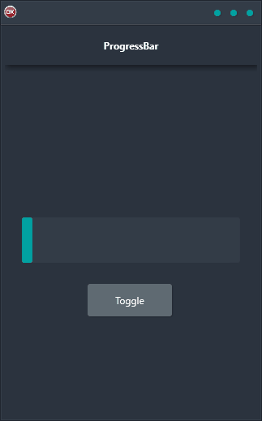

Do you want a product that is cross-platform, easy to use, and has a single code base with a single UI? Do you want something that looks great on any device, whether it’s an Android phone, an iOS tablet, or a Windows desktop? Then you want the ProgressBar Demo!

The ProgressBar Demo features a ProgressBar control and a timer. The ProgressBar control is easy to use and ensures that your progress is displayed clearly. The timer allows you to update the progress displayed in the ProgressBar control.

The ProgressBar Demo is built in Delphi using a single code base and single UI for Android, iOS, macOS, Windows, and Linux. This

