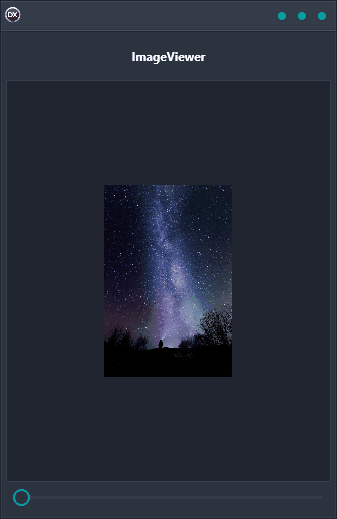

ImageViewer Demo is a cross-platform application that allows you to view images and zoom in on them using a slider control. It is built using Delphi, making it portable across multiple platforms including Android, iOS, macOS, Windows, and Linux. The ImageViewer control makes it easy to view images in high detail, and the zoom feature lets you get a closer look at the image. Whether you're looking for a quick way to view images on your phone or tablet, or you need a more powerful tool for viewing images on your computer, ImageViewer Demo is the perfect solution.

