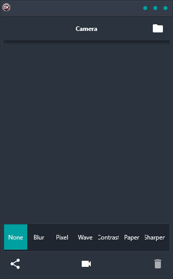

The Camera Demo is a powerful cross-platform camera application that lets you capture stunning images and apply effects to them with ease. With support for Android, iOS, macOS, Windows, and Linux, the Camera Demo is perfect for anyone who wants to take great photos and add some extra flair to them. Blur effects make your photos stand out, and sharing capabilities let you share your creations with friends and family easily. If you're looking for a great camera application that offers an easy-to-use interface and lots of features, the Camera Demo is the perfect choice.

