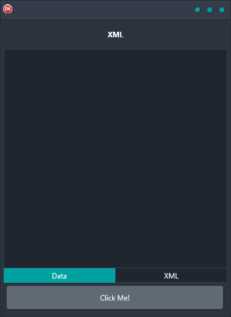

If you're looking for a way to load and parse XML files cross-platform, then the XML Demo is the perfect solution. This handy little app is built in Delphi and uses the DOM to display parts of the XML file, making it easy to see how your data is structured. It's great for Android, iOS, macOS, Windows, and Linux, so you can use it on any platform you like. Plus, it has a single code base and UI, so it's easy to use regardless of your operating system. So why wait? Get the XML Demo today!

