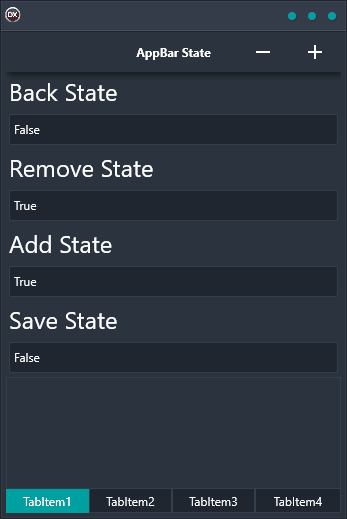

The AppBar State Demo is a demo that shows how to store different button states in the AppBar at the top of the application via data bindings. It is a cross-platform application built in Delphi with a single codebase and single UI that supports multiple platforms including Android, iOS, macOS, Windows, and Linux. The AppBar State Demo allows you to change the states of different buttons in the AppBar, such as changing the color of a button or the text of a button. The demo also shows how to bind the state of a button to a variable in the application so that when the variable changes, the button state will automatically update. This is a useful feature for keeping track of different application states or for providing feedback to the user about an action that has occurred.

