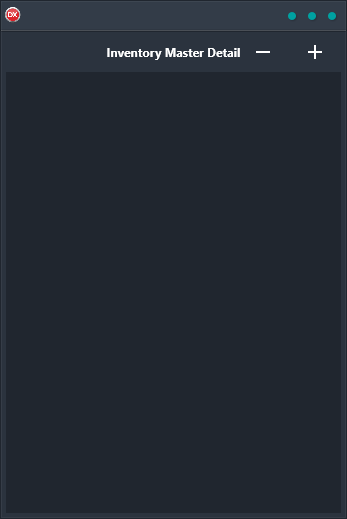

If you're looking for a simple, yet powerful inventory management solution, look no further than the Inventory Master Detail Demo. This cross-platform application makes it easy to keep track of your inventory, whether you're using Android, iOS, macOS, Windows, or Linux. With data bindings and an in-memory data set, the Inventory Master Detail Demo makes it easy to input and retrieve information about your products. Plus, with a single codebase and single UI, you can be sure that the experience is consistent no matter what platform you're using. So why wait? Give the Inventory Master Detail Demo a try today!

