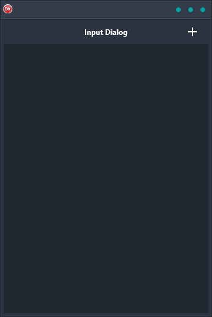

The Input Dialog Demo is a great way to learn how to use the platform input dialog box to add data to an in-memory table. This cross-platform application is built in Delphi with a single codebase and single UI that supports multiple platforms including Android, iOS, macOS, Windows, and Linux. The Input Dialog Demo makes it easy to add data to an in-memory table and then automatically display it via data bindings. With this demo, you'll be able to quickly and easily learn how to use the platform input dialog box to add data to an in-memory table.

