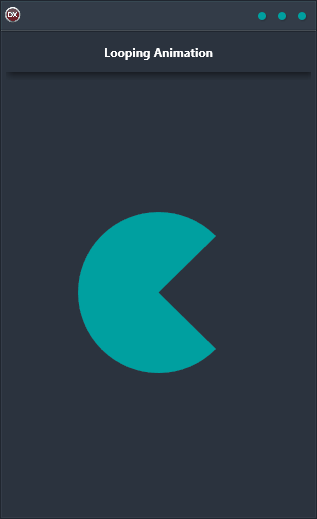

If you're looking for an easy way to create looping animations, the Looping Animation Demo is the perfect solution. With no code required, it's a quick and easy way to get your animations up and running on multiple platforms. Whether you're animating for Android, iOS, macOS, Windows, or Linux, the Looping Animation Demo supports all major platforms with a single codebase and single UI. Plus, it's built in Delphi, so you can be sure of its cross-platform compatibility. So if you're looking for a fast and simple solution for your looping animation needs, the Looping Animation Demo is the perfect choice.

