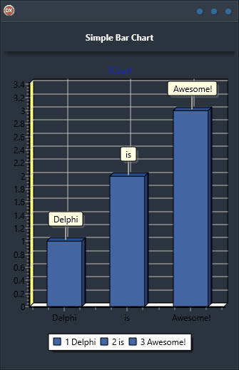

Looking to add some helpful visualisations to your app? Check out the Simple Bar Chart Demo, which shows just how easy it is to include charts. In this demo, a simple bar chart series is featured. As an added bonus, the demo is cross-platform and built in Delphi, so it supports Android, iOS, macOS, Windows, and Linux. Plus, it has a single codebase and single UI – so you won’t have to worry about learning multiple different platforms. Give your app the boost it needs with the Simple Bar Chart Demo today!

