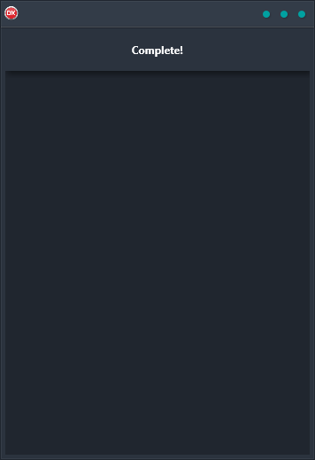

The Run At Startup Demo is a cross-platform application that demonstrates how to use the OnIdle event to run code once at application has completed starting up. In this demo it executes an asynchronous REST call and displays the data via data bindings in a in-memory table. It is built in Delphi with a single codebase and single UI that supports multiple platforms including Android, iOS, macOS, Windows, and Linux. This demo is a great way to learn how to use the OnIdle event to run code on startup, and it's also a great example of the power of Delphi for cross-platform development.

