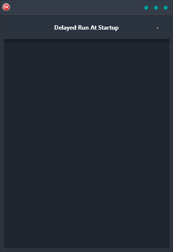

Delayed Run At Startup Demo is an easy-to-use, cross-platform solution that allows you to execute code at the start of your application, but with the execution of the code delayed until the app is completely loaded. With support for Android, iOS, macOS, Windows, and Linux, it is the perfect choice for those who need a reliable and easy-to-use solution that works on any platform. With its clean and simple interface, it is easy to use and provides the perfect solution for anyone looking for a cross-platform application.

